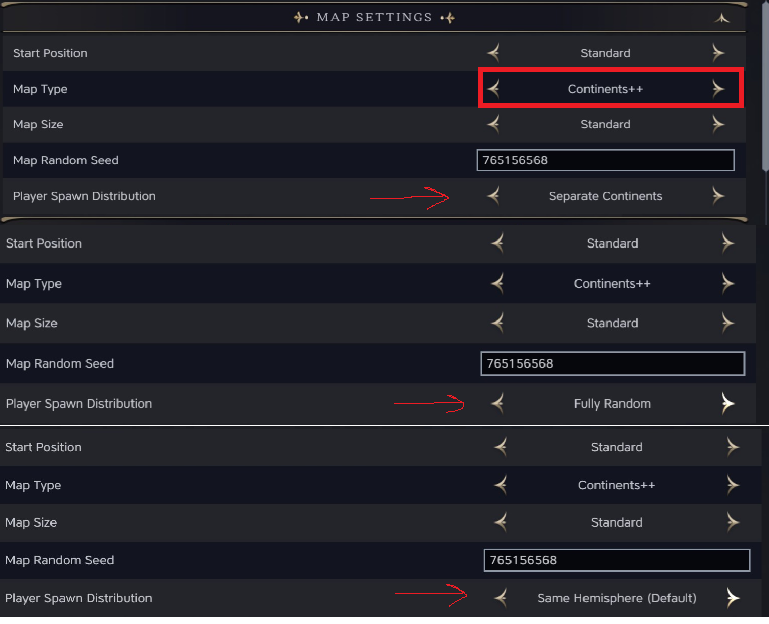

# Continents++ for Civilization VII

Enhanced map generation using Voronoi plate tectonics simulation. Creates unique, Earth-like continents with organic coastlines, scattered archipelagos, and varied landmass sizes every game. Includes configurable player spawn distribution for multiplayer flexibility.


## Why This Mod Exists

Great strategy maps share a common DNA with the best fantasy cartography. Think of Middle-earth, Westeros, or the worlds of your favorite RPGs - they all feature **asymmetric landmasses** of varying sizes, **organic coastlines** that invite exploration, and **strategic chokepoints** that make geography matter.

The base game's "Continents" map type generates exactly two landmasses every time. While functional, this creates predictable gameplay: two teams, two sides, same strategic calculus game after game. Real Earth has seven continents of wildly different sizes. Tolkien's world has sprawling Arda alongside the isolated Numenor. Geography should create stories, not just divide players.

**Continents++** was built to bring that sense of discovery back to Civilization VII:

- **Unpredictability**: You might spawn on a massive supercontinent or a modest island nation. Your neighbors might be across a narrow strait or an ocean away. Every game presents a unique geopolitical puzzle.

- **Organic Beauty**: Fractal erosion algorithms carve realistic coastlines with bays, peninsulas, and natural harbors. No more cookie-cutter continent shapes.

- **Emergent Strategy**: With 3-7 continents of varying sizes, naval power matters differently each game. Some maps reward early exploration; others demand continental consolidation first.

- **Replayability**: Randomized parameters mean even the same map seed produces different erosion patterns, island distributions, and terrain features.

The goal is simple: every new game should feel like unrolling a hand-drawn map for the first time.

## Features

- **3-7 Dynamic Continents**: Unlike the base game's fixed 2-continent system, generates multiple landmasses that scale with map size
- **Randomized Parameters**: Each map uses different erosion, island counts, and terrain settings for maximum replayability
- **Earth-like Water Coverage**: Targets ~65-70% water for realistic ocean-to-land ratios
- **Organic Coastlines**: Fractal erosion creates natural-looking shores and bays
- **Scattered Archipelagos**: Mid-ocean islands and coastal island chains
- **Asymmetric Landmasses**: Continents vary in size like real-world geography
- **Player Spawn Options**: Choose clustered, spread, or random distribution for multiplayer
- **Intelligent Distant Lands**: Adjacent continents connected by coast are correctly treated as reachable — only true ocean crossings count as Distant Lands
- **Works Across All Ages**: Fully compatible with Antiquity, Exploration, and Modern era transitions

## Installation

### Option 1: Manual Installation

1. Download or clone this repository
2. Copy the `ContinentsPlusPlus` folder to your Civilization VII mods directory:
   ```
   %LOCALAPPDATA%\Firaxis Games\Sid Meier's Civilization VII\Mods\
   ```
   Full path example:
   ```
   C:\Users\YourName\AppData\Local\Firaxis Games\Sid Meier's Civilization VII\Mods\ContinentsPlusPlus\
   ```

3. The folder structure should look like:
   ```
   Mods/
   └── ContinentsPlusPlus/
       ├── ContinentsPlusPlus.modinfo
       ├── README.md
       └── modules/
           ├── config/
           ├── maps/
           └── text/
   ```

### Option 2: Git Clone

```bash
cd "%LOCALAPPDATA%\Firaxis Games\Sid Meier's Civilization VII\Mods"
git clone https://github.com/ghost-ng/ContinentsPlusPlus.git
```

## Usage

1. Launch Civilization VII
2. Start a new game
3. In the game setup screen, select **"Continents++"** from the Map Type dropdown
4. Configure other game settings as desired
5. Start your game!

## Map Size Scaling

The mod automatically adjusts continent count based on map size:

| Map Size | Continents | Description |
|----------|------------|-------------|
| Tiny     | 3-4        | Compact landmasses for quick games |
| Small    | 3-5        | Balanced for smaller player counts |
| Standard | 4-5        | Classic multi-continent experience |
| Large    | 4-6        | Expansive world with room to explore |
| Huge     | 5-7        | Epic scale with many distinct landmasses |

## Advanced Map Settings

Continents++ adds a **Player Spawn Distribution** option to customize how players are placed across the map.



| Setting | Description |
|---------|-------------|
| **Clustered (Default)** | Human players spawn on the same or nearby continents. Ideal for cooperative and team-based play. Maximizes distant lands for shared exploration. |
| **Spread** | Human players spawn on different continents for competitive play. Always preserves at least one continent as distant lands for the exploration race. |
| **Random** | All players distributed proportionally by continent size. Maximum unpredictability — you never know who your neighbors will be. |

To access this option:
1. Select **Continents++** as your map type
2. Click on **Advanced Settings** in the game setup screen
3. Find **Player Spawn Distribution** under Map Options

## Technical Details

- Built on Civ VII's Voronoi plate tectonics system for natural landmass generation
- Seeded random number generation ensures reproducible maps with the same seed
- Integrates with base game terrain generation (biomes, resources, natural wonders)
- Smart player distribution accounts for continent size and capacity

## Compatibility

- **Civilization VII**: Version 1.0+
- **Required DLC**: None (base game only)
- **Mod Conflicts**: May conflict with other map generation mods

## Troubleshooting

**Map won't generate / crashes on load:**
- Fully close and restart Civilization VII (the game caches JavaScript modules)
- Check the game logs for error messages

**Only seeing 2 continents:**
- Make sure you've restarted the game after installing/updating the mod
- Verify the mod is enabled in your mod manager

**Finding the logs:**
```
%LOCALAPPDATA%\Firaxis Games\Sid Meier's Civilization VII\Logs\
```

## License

MIT License - Feel free to modify and redistribute.

## Credits

- **Author**: ghost-ng
- **AI Assistance**: Claude (Anthropic)
- **Base System**: Firaxis Games' Voronoi plate tectonics engine
