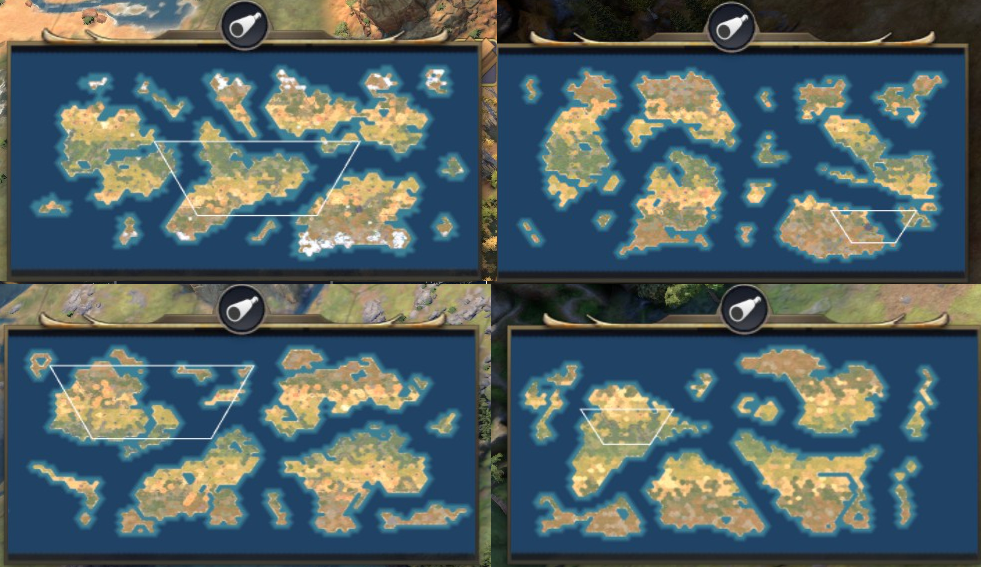

# Continents++ for Civilization VII

Enhanced map generation using Voronoi plate tectonics simulation. Creates unique, Earth-like continents with organic coastlines, scattered archipelagos, and varied landmass sizes every game.



## Features

- **3-7 Dynamic Continents**: Unlike the base game's fixed 2-continent system, generates multiple landmasses that scale with map size
- **Randomized Parameters**: Each map uses different erosion, island counts, and terrain settings for maximum replayability
- **Earth-like Water Coverage**: Targets ~65-70% water for realistic ocean-to-land ratios
- **Organic Coastlines**: Fractal erosion creates natural-looking shores and bays
- **Scattered Archipelagos**: Mid-ocean islands and coastal island chains
- **Asymmetric Landmasses**: Continents vary in size like real-world geography

## Installation

### Option 1: Manual Installation

1. Download or clone this repository
2. Copy the `ContinentsPlusPlus` folder to your Civilization VII mods directory:
   ```
   %LOCALAPPDATA%\Firaxis Games\Sid Meier's Civilization VII\Mods\
   ```
   Full path example:
   ```
   C:\Users\YourName\AppData\Local\Firaxis Games\Sid Meier's Civilization VII\Mods\ContinentsPlusPlus\
   ```

3. The folder structure should look like:
   ```
   Mods/
   └── ContinentsPlusPlus/
       ├── ContinentsPlusPlus.modinfo
       ├── README.md
       └── modules/
           ├── config/
           ├── maps/
           └── text/
   ```

### Option 2: Git Clone

```bash
cd "%LOCALAPPDATA%\Firaxis Games\Sid Meier's Civilization VII\Mods"
git clone https://github.com/ghost-ng/ContinentsPlusPlus.git
```

## Usage

1. Launch Civilization VII
2. Start a new game
3. In the game setup screen, select **"Continents++"** from the Map Type dropdown
4. Configure other game settings as desired
5. Start your game!

## Map Size Scaling

The mod automatically adjusts continent count based on map size:

| Map Size | Continents | Description |
|----------|------------|-------------|
| Tiny     | 3-4        | Compact landmasses for quick games |
| Small    | 3-5        | Balanced for smaller player counts |
| Standard | 4-5        | Classic multi-continent experience |
| Large    | 4-6        | Expansive world with room to explore |
| Huge     | 5-7        | Epic scale with many distinct landmasses |

## Technical Details

- Uses `UnifiedContinentsBase` from Civ VII's Voronoi plate tectonics system
- Seeded random number generation ensures reproducible maps with the same seed
- Compatible with all ages (Antiquity, Exploration, Modern)
- Integrates with base game terrain generation (biomes, resources, natural wonders)

## Compatibility

- **Civilization VII**: Version 1.0+
- **Required DLC**: None (base game only)
- **Mod Conflicts**: May conflict with other map generation mods

## Troubleshooting

**Map won't generate / crashes on load:**
- Fully close and restart Civilization VII (the game caches JavaScript modules)
- Check the game logs for error messages

**Only seeing 2 continents:**
- Make sure you've restarted the game after installing/updating the mod
- Verify the mod is enabled in your mod manager

**Finding the logs:**
```
%LOCALAPPDATA%\Firaxis Games\Sid Meier's Civilization VII\Logs\
```

## License

MIT License - Feel free to modify and redistribute.

## Credits

- **Author**: ghost-ng
- **AI Assistance**: Claude (Anthropic)
- **Base System**: Firaxis Games' Voronoi plate tectonics engine
